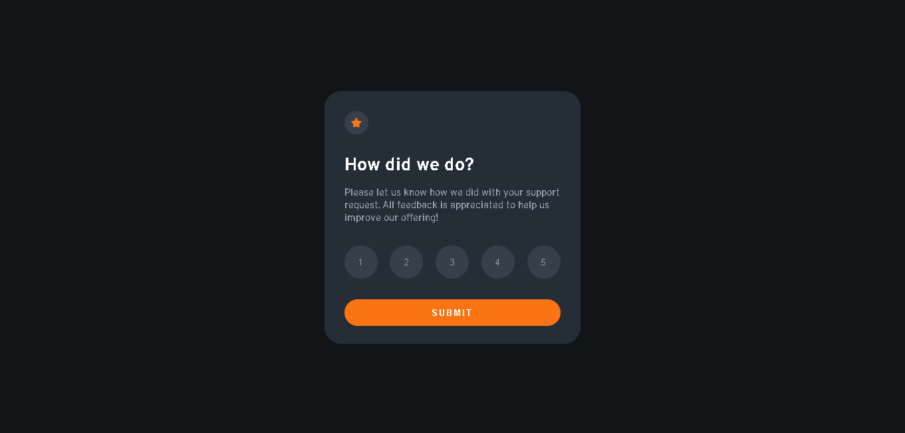

## Table of contents

- [Overview](#overview)
  - [The challenge](#the-challenge)
  - [Screenshot](#screenshot)
  - [Links](#links)
  - [Built with](#built-with)
  - [Continued development](#continued-development)
- [Author](#author)

## Overview

To Run this app please run the script 'npm run start' in your terminal. You need to have the NPM installed in your pc and be on the root directory to do it.

### The challenge

Users should be able to:

- View the optimal layout for the app depending on their device's screen size
- See hover states for all interactive elements on the page
- Select and submit a number rating
- See the "Thank you" card state after submitting a rating

### Screenshot

### Links

- Solution URL: [https://rating-app-fawn.vercel.app/](https://rating-app-fawn.vercel.app/)

### Built with

- [React](https://reactjs.org/) - JS library
- [Styled Components](https://styled-components.com/) - For styles

### Continued development

Im gonna focus on React useState and other hooks from react to increase my skill

Also trying to implement Context API.

## Author

- Linkedin - [Jhonatta Silva](https://www.linkedin.com/in/jhonatta-silva-dev/)

